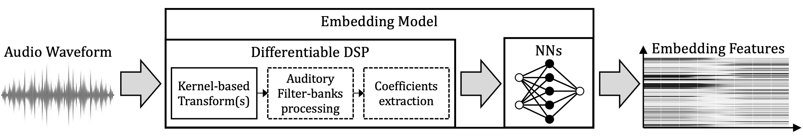

# torch-dae: an AI skill-based framework for Audio Embedding Models

[](https://github.com/StefanoGiacomelli/torch_dae/actions/workflows/ci.yml)
[](https://codecov.io/gh/StefanoGiacomelli/torch_dae)
[](https://pypi.org/project/torch-deepaudioembedding/)
[](https://doi.org/10.5281/zenodo.21641390)
[](https://torch-dae.readthedocs.io/en/stable/?badge=stable)
[](https://www.python.org/)
[](LICENSE)

`torch-dae` is a reproducible integration and profiling framework for PyTorch audio models. It
connects one explicit model variant and checkpoint to a validated runtime environment, a typed
waveform/output interface, runtime-verification evidence, and optional performance Technical Cards.
The repository also ships agent skills for controlled model onboarding and profiling.

<p align="center">
  
</p>

## What you can do

- **Use accepted audio models through one typed PyTorch wrapper contract.**
- **Extract checkpoint-specific embeddings** with declared dimensions and semantics.
- **Recreate model runtimes reproducibly** from committed environment definitions instead of
  installing model dependencies into the root package.
- **Acquire checkpoints explicitly** through a content-addressed cache; weights are never silently
  downloaded during import or wrapper construction.
- **Inspect checkpoint-specific Model Cards** describing input, output, embedding, runtime, and
  limitation contracts.
- **Profile accepted models** on CPU, MPS, and CUDA selectors supported by the local machine and
  generate candidate Technical Cards with raw timing measurements.
- **Integrate additional models with the `audio-model-onboarding` skill** through controlled
  analysis, environment resolution, integration, verification, and card-generation phases.

The framework deliberately separates model execution from repository control. The root package
stays lightweight; heavyweight or mutually incompatible model dependencies live in isolated,
model-specific environments.

## Supported models

The repository currently contains three accepted PANNs / AudioSet checkpoint integrations. Each is
`runtime_verified` and has canonical Profiling v1 Technical Cards for CPU and Apple MPS execution
contexts.

| Model Card ID | Wrapper | Native sample rate | Input | Primary output | Default embedding | Locally verified devices |
|---|---|---:|---|---|---|---|
| `panns-cnn14-16k-map-0438` | `PannsCnn14_16kMap0438` | 16 kHz | `[B,1,T]` | logits `[B,527]` | `[B,2048]` | CPU, MPS |
| `panns-resnet38-map-0434` | `PannsResNet38Map0434` | 32 kHz | `[B,1,T]` | logits `[B,527]` | `[B,2048]` | CPU, MPS |
| `panns-wavegram-logmel-cnn14-map-0439` | `PannsWavegramLogmelCnn14Map0439` | 32 kHz | `[B,1,T]` | logits `[B,527]` | `[B,2048]` | CPU, MPS |

CUDA is declared by the upstream PANNs implementation but has not been locally verified by the
accepted Model Cards. The currently accepted PANNs environment definitions constrain managed
materialization to macOS on arm64. See [PANNs integration](docs/models/panns-runtime.md) for the exact
runtime and duration constraints.

## Installation

### Package installation

The published distribution is named `torch-deepaudioembedding`; the import package is `torch_dae`
and the console command is `torch-dae`.

```bash
pip install torch-deepaudioembedding
python -c "import torch_dae"
torch-dae --help
```

The wheel provides the Python package and CLI control plane. It intentionally does **not** bundle the
repository's Model Cards, environment definitions, verification reports, Technical Cards, agent
skills, or model checkpoints.

### Full repository workspace

Use a source checkout for the complete registry-backed workflow: supported models, managed
environments, checkpoint acquisition, runtime verification, profiling, and the agent skills.

```bash
git clone https://github.com/StefanoGiacomelli/torch_dae.git
cd torch_dae
uv sync --python 3.11 --all-groups --extra profiling --frozen
uv run torch-dae --help
```

Model-specific PyTorch stacks are **not** installed into this root environment. They are
materialized separately from `environments/<environment-id>/` when a model runtime is needed.

Full installation guidance: [docs/getting-started/installation.md](docs/getting-started/installation.md).

## Quick start

From a source checkout:

```bash
uv run torch-dae card list
uv run torch-dae card show panns-cnn14-16k-map-0438
uv run torch-dae technical-card list
```

Expected Model Card IDs:

```text
panns-cnn14-16k-map-0438
panns-resnet38-map-0434
panns-wavegram-logmel-cnn14-map-0439
```

The first command discovers accepted model identities without importing the model runtime. The
second prints the normalized checkpoint-specific Model Card. The third lists canonical empirical
profiling evidence already accepted under `technical_cards/`.

For an end-to-end pretrained PANNs example, including environment creation, checkpoint acquisition,
and Python inference, follow the
[PANNs inference tutorial](docs/tutorials/panns-inference.md).

## Model execution at a glance

A supported wrapper receives a floating-point waveform tensor and an integer native sample rate.
For the current PANNs integrations, the public input layout is always:

```text
[B, 1, T]
```

where `B` is batch size, the channel dimension must be exactly `1`, and `T` is the number of audio
samples. The wrappers do not automatically resample, downmix, normalize amplitude, pad, crop, or
truncate the input.

Inside the verified model environment, the core API is:

```python
from pathlib import Path

import torch

from torch_dae import ModelCardRegistry

card_id = "panns-cnn14-16k-map-0438"
checkpoint_path = Path("/absolute/path/to/Cnn14_16k_mAP=0.438.pth")

registry = ModelCardRegistry(Path.cwd())
model_class = registry.get_model_class(card_id)
model = model_class.from_pretrained(checkpoint_path).eval()

waveform = torch.zeros(1, 1, 16_000, dtype=torch.float32)

with torch.no_grad():
    output = model(waveform, 16_000)
    embedding = model.compute_embedding(waveform, 16_000)

print(output.primary.shape)                  # torch.Size([1, 527])
print(output.tensors["probabilities"].shape) # torch.Size([1, 527])
print(embedding.tensor.shape)                # torch.Size([1, 2048])
```

`from_pretrained()` never downloads a default checkpoint. Supply a checkpoint already materialized
by `torch-dae checkpoint ensure <card-id>` or another explicitly controlled path.

### PANNs output contract

| Access path | Meaning | Shape |
|---|---|---|
| `output.primary` | raw AudioSet classifier logits | `[B,527]` |
| `output.tensors["logits"]` | same raw logits | `[B,527]` |
| `output.tensors["probabilities"]` | native `sigmoid(logits)` multi-label probabilities | `[B,527]` |
| `output.tensors["embedding"]` | upstream post-`fc1`, pre-classifier representation | `[B,2048]` |
| `model.compute_embedding(...).tensor` | selected default embedding | `[B,2048]` |

Do not apply a softmax to the 527-class output: PANNs performs multi-label audio tagging and exposes
independent sigmoid probabilities. No threshold or class aggregation is applied by the wrapper.

Detailed execution semantics: [docs/user-guide/model-execution.md](docs/user-guide/model-execution.md).

## Embeddings

All three current PANNs Model Cards expose one verified default embedding:

```text
panns-official-post-fc1-embedding
```

It is a clipwise `[B,2048]` representation produced after `ReLU(fc1)` and the following dropout
call, immediately before the final AudioSet classifier. In evaluation mode the dropout call is the
identity.

```python
embedding = model.compute_embedding(
    waveform,
    sample_rate,
    embedding_id=None,  # use the Model Card default
)
print(embedding.embedding_id)
print(embedding.layout)       # B,D
print(embedding.tensor.shape) # [B,2048]
```

See [docs/user-guide/embeddings.md](docs/user-guide/embeddings.md).

## Profiling a supported model

Profiling is optional empirical evidence and never mutates the accepted Model Card. A profiling run
creates candidate Technical Card JSON plus compact raw `.npz` measurements in a repository-local
candidate directory.

Example CPU run:

```bash
uv run torch-dae model profile \
  --model panns-cnn14-16k-map-0438 \
  --device cpu \
  --energy off \
  --output-dir profiling_candidates/panns-cnn14-cpu
```

The user-selectable controls are:

```text
--model
--device auto|cpu|mps|cuda|cuda:<index>   (repeatable)
--protocol audio-inference-v1
--energy auto|off
--allow-privileged-energy
--output-dir
--json
```

Profiling v1 fixes the comparable measurement protocol rather than exposing every benchmark detail
as a CLI knob: deterministic seeded float32 white noise, batch sizes `1,2,4,8`, 10 warmups, 50
measured steady-state inferences, and both `single_thread` and `native_default` regimes for CPU.

After a run, inspect the Technical Card JSON for summarized architecture, latency, throughput,
real-time factor, memory, energy coverage, and minimum-input evidence. Use the accompanying `.npz`
when you need the raw latency observations. Canonical Technical Cards already accepted for the PANNs
models live under `technical_cards/<model-id>/`.

Profiling guide: [docs/profiling/overview.md](docs/profiling/overview.md).

## Model Cards and Technical Cards

These artifacts answer different questions:

| Artifact | Question it answers | Typical contents |
|---|---|---|
| **Model Card** | *What exactly is this supported model/checkpoint and how may I call it?* | identity, checkpoint, environment, waveform contract, outputs, embedding, verified devices, limitations |
| **Technical Card** | *How did that accepted model behave in one profiling context?* | device/backend, latency, throughput, RTF, memory, energy, minimum input, architecture metrics, raw-measurement reference |

One checkpoint-specific Model Card may therefore have zero, one, or many Technical Cards. Profiling
adds evidence; it does not change model identity or acceptance status.

## Integrating a new model with the skill

The canonical `audio-model-onboarding` skill separates integration into reviewable phases:

```text
analyze
  ↓
resolve-environment
  ↓
integrate
  ↓
verify
  ↓
card
```

Run one phase per agent request and review the produced evidence before authorizing the next phase.
A good first request is:

```text
Use the canonical `audio-model-onboarding` skill available in this repository.

MODE: analyze
WORKFLOW_ID: <STABLE_WORKFLOW_ID_OR_AUTO_DISCOVER>

MODEL_NAME: <MODEL_NAME>
UPSTREAM_REPOSITORY: <GITHUB_REPOSITORY_URL>
PAPER_OR_TECHNICAL_REFERENCE: <PAPER_URL_OR_NONE>

TARGET_VARIANT: <VARIANT_NAME_OR_AUTO_DISCOVER>
TARGET_CHECKPOINT: <CHECKPOINT_NAME_OR_AUTO_DISCOVER>
PREFERRED_EMBEDDING: <EMBEDDING_NAME_OR_UNRESOLVED>

ADDITIONAL_CONSTRAINTS:
<OPTIONAL_PROJECT_SPECIFIC_CONDITIONING_OR_NONE>

Inspect the upstream project statically, identify the supported model/checkpoint/embedding
candidates, report unresolved decisions, and stop at the analyze-mode boundary. Do not continue to
environment resolution until I explicitly approve the analysis.
```

The exact canonical template is in
[`skills/audio-model-onboarding/templates/agent-request.md`](skills/audio-model-onboarding/templates/agent-request.md).
The onboarding skill and the independent profiling skill are documented under
[`skills/`](skills/) and in the [documentation](docs/index.md). A larger copy-paste prompt library is
part of the user documentation work for the next release.

## Repository layout

```text
src/torch_dae/                         Python control plane and public wrappers
model_cards/                           Accepted checkpoint-specific Model Cards
environments/                          Committed isolated-runtime definitions
verification_reports/                  Accepted checkpoint runtime observations
technical_cards/                       Accepted empirical profiling evidence
onboarding_reports/                    Accepted cross-phase onboarding artifacts
skills/audio-model-onboarding/         Canonical model-integration agent skill
skills/audio-model-profiling/          Canonical profiling agent skill
schemas/                               Generated strict JSON Schemas
docs/                                  User, API, workflow, and developer documentation
tests/                                 Contract, runtime, safety, and regression tests
.torch-dae/                            Ignored local runtime/cache/workspace state
```

Model checkpoint payloads are not committed to the repository.

## Documentation

Read the hosted documentation at <https://torch-dae.readthedocs.io/en/stable/>.

Recommended entry points:

- [Installation](docs/getting-started/installation.md)
- [Mental model](docs/getting-started/mental-model.md)
- [Quickstart](docs/getting-started/quickstart.md)
- [Supported models](docs/models/index.md)
- [PANNs inference tutorial](docs/tutorials/panns-inference.md)
- [Model execution](docs/user-guide/model-execution.md)
- [Embeddings](docs/user-guide/embeddings.md)
- [Profiling](docs/profiling/overview.md)
- [Onboarding skill](docs/skill/overview.md)
- [Python API](docs/api/index.md)

## Development

The root development environment remains model-agnostic. Model runtimes are exercised through their
isolated environments rather than by adding heavyweight dependencies to the package root.

```bash
uv sync --python 3.11 --all-groups --extra profiling --frozen
uv run --python 3.11 --all-groups --extra profiling --frozen ruff format --check
uv run --python 3.11 --all-groups --extra profiling --frozen ruff check
uv run --python 3.11 --all-groups --extra profiling --frozen mypy src scripts
uv run --python 3.11 --all-groups --extra profiling --frozen pytest
uv run --python 3.11 --all-groups --extra profiling --frozen python scripts/validate_repository.py
uv run --python 3.11 --all-groups --extra profiling --frozen sphinx-build -W --keep-going -b html docs docs/_build/html
```

See [CONTRIBUTING.md](CONTRIBUTING.md) for the full contribution contract.

## Current boundaries

- The repository does not redistribute pretrained checkpoint payloads; accepted assets are acquired
  explicitly from their authoritative providers.
- The current accepted PANNs managed environments are constrained to macOS/arm64. CUDA support is
  upstream-declared but not locally verified by the accepted cards.
- PANNs inputs must already be mono floating-point tensors at the exact native sample rate. Automatic
  resampling, downmixing, amplitude normalization, padding, cropping, and truncation are not part of
  the wrapper contract.
- Padded batches with unequal `valid_lengths` are not currently supported by the PANNs wrappers.
- `torch-dae model inspect` remains an explicit unavailable-feature placeholder.
- Candidate profiling evidence is never promoted automatically into `technical_cards/`; promotion is
  a separate human-reviewed repository operation.

## Funding

The research project title is:

*Methods of Computational Auditory Scene Analysis and Synthesis supporting eXtended and Immersive
Reality Services*

Research activities were mainly funded under the Ministerial Decree (DM) 118/2023, Mission 4,
Component 1, Investment 4.1 of the National Recovery and Resilience Plan (PNRR) – “PNRR Research” –
CUP: E11I23000100001.

## Citations

Use the repository's [CITATION.cff](CITATION.cff) for software citation metadata. The stable
concept DOI for the complete software series is
[`10.5281/zenodo.21641390`](https://doi.org/10.5281/zenodo.21641390). Zenodo assigns an immutable
version-specific DOI after each GitHub release is archived; use that record when citing an exact
release.

When discussing the framework design, standardization rationale, or deployment methodology, also
cite:

```bibtex
@inproceedings{giacomelli2025torch_dae,
  author    = {Giacomelli, Stefano and Centofanti, Carlo and
               Graziosi, Fabio and Rinaldi, Claudia},
  title     = {{Design and Deployment of a Standard Framework for
                Audio Neural Networks Embedding Models}},
  booktitle = {2025 IEEE Symposium on Computers and Communications (ISCC)},
  year      = {2025},
  pages     = {1--6},
  doi       = {10.1109/ISCC65549.2025.11326439},
  publisher = {IEEE}
}
```

## License

Licensed under the [Apache License 2.0](LICENSE). Attribution information is provided in
[NOTICE](NOTICE).

## Contact

**Stefano Giacomelli**<br>
ICT - Ph.D. Candidate<br>
Department of Information Engineering, Computer Science and Mathematics (DISIM)<br>
University of L'Aquila, Italy

- **Email:** [stefano.giacomelli@graduate.univaq.it](mailto:stefano.giacomelli@graduate.univaq.it)
- **GitHub:** [StefanoGiacomelli](https://github.com/StefanoGiacomelli)
- **ORCID:** [0009-0009-0438-1748](https://orcid.org/0009-0009-0438-1748)
- **Google Scholar:** [Profile](https://scholar.google.com/citations?user=l-n0hl4AAAAJ&hl=en)
- **LinkedIn:** [Profile](https://www.linkedin.com/in/stefano-giacomelli-811654135)
